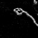
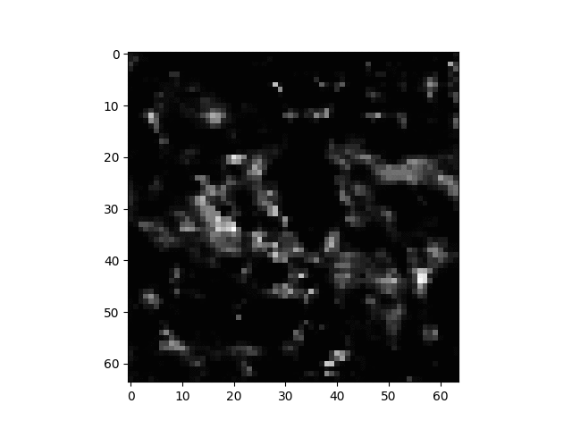

# chainer-causal-info-gan
Reproduction codes of Causal Info GAN with chainer

# About
[See this original paperl](https://arxiv.org/abs/1807.09341) for details

# Prerequisites

Download rope_full and seq_data_2 datasets from [author's github repo](https://github.com/thanard/causal-infogan)
and place the datasets under datasets directory as below

```
datasets
  ├── rope_full
  │       ├── run05
  │       ├── run06
  │        ...
  └── seq_data_2
        ├── goal
        │   └── all
        │       ├── img_0000_g.jpg
        │        ...
        └── start
            └── all
                ├── img_0000_s.jpg
                 ...
```

# Results
## Rope image generation

|rope state|next rope state|
|:---:|:---:|
|||

## Planning

Work is in progress... Rope images are successfully generated but planning still fails. See below



These images can be obtained with below command

```sh
$ python3 tester.py --generator-parameter=trained_models/generator_epoch-100 --posterior-parameter=trained_models/posterior_epoch-100 --subtractor-parameter=trained_models/subtractor.model --transition-parameter=trained_models/transision_epoch-100 --classifier-parameter=trained_models/classifier.model --start-image=datasets/seq_data_2/start/all/img_0000_s.jpg --goal-image=datasets/seq_data_2/goal/all/img_0000_g.jpg
```